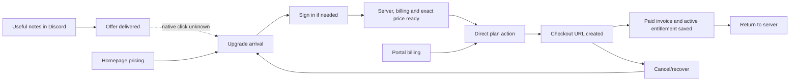

# Purchase and useful-notes events

Custom events contain shape, never meeting content or raw error/promotion values.
The only product identifiers are `guild_id` and the acting Discord user as the
distinct ID. Actorless events use the existing guild-scoped identity.

All custom events carry `environment` and `surface`. Calls with no known user
surface are labeled `server`; Discord meetings and delivered offers identify
their surface explicitly. The configured frontend origin identifies production
(`chronote.gg`) and Sandbox (`sandbox.chronote.gg`);
localhost is local, and other origins are explicitly unknown. Production reports
must filter to production, excluding unknown and controlled operator activity.

| Event                       | Boundary                                                                       | Safe properties beyond environment/surface/identity                                                                                 |
| --------------------------- | ------------------------------------------------------------------------------ | ----------------------------------------------------------------------------------------------------------------------------------- |
| `upgrade_arrived`           | Once per mounted purchase-route entry                                          | source, canceled, event_version=1                                                                                                   |
| `upgrade_auth_started`      | Explicit purchase-page sign-in action                                          | source, promo_present, event_version=1                                                                                              |
| `upgrade_blocked`           | Displayed blocking reason changes                                              | source, requested tier/interval, promo_present, reason, event_version=1                                                             |
| `upgrade_ready`             | Authenticated manageable server, fresh billing and exact requested price       | source, tier/interval, promo_present, event_version=1                                                                               |
| `upgrade_plan_clicked`      | Explicit eligible paid-tier action on Upgrade or Billing                       | source, tier/interval, promo_present, event_version=1                                                                               |
| `billing_checkout_created`  | New Stripe subscription checkout returns a URL                                 | source, tier/interval, promo_present, billing_kind, event_version=1                                                                 |
| `billing_checkout_rejected` | Billing configuration, price, promotion or guarded transition refuses checkout | fixed reason, source, optional tier/interval, event_version=1                                                                       |
| `billing_entitlement_saved` | Verified paid positive-value invoice, persisted active Stripe entitlement      | source, tier/interval, promo_present, billing_kind, event_version=1                                                                 |
| `upgrade_offer_delivered`   | Successful CTA-bearing summary or final-notes message                          | surface=discord_summary or discord_notes, event_version=1                                                                           |
| `meeting_completed`         | Existing finalization and cancellation paths                                   | existing flags/counts plus transcription_outcome, notes_outcome, history_persistence, notes_delivery, usable_notes, event_version=2 |

Without an explicit plan in the link, readiness defaults to Pro for a paid Basic
subscriber and Basic otherwise. Explicit plan intent remains unchanged.

`usable_notes` requires non-cancellation, ready transcription, generated non-empty
notes, successful history storage and complete notes delivery. It is a technical
activation proxy, not a user's assessment. Original `transcribed` and
`notes_generated` fields remain configuration flags for historical compatibility.

Purchase source is a user-supplied enum, never authorization: homepage_pricing,
discord_summary, discord_notes, discord_limit, portal_billing, direct, unknown.
It survives sign-in, server recovery and new-checkout provider returns/metadata.
Webhook source and purchaser identity describe the original subscription entry,
not the actor of a later automatic renewal or portal plan change. `promo_present`
describes the code originally supplied through Chronote, not a currently applied
discount or a code entered directly in Stripe.
Invalid values become unknown. Existing subscription confirmation uses the
guarded billing path and is not reported as a new-subscription checkout.

Paid outcomes have one canonical producer, `invoice.payment_succeeded`.
Subscription-upsert and checkout-completed notifications do not emit conversion.
`subscription_create`, `subscription_cycle` and `subscription_update` invoice
reasons classify initial_purchase, renewal and plan_change; other reasons are
unknown. Trials, zero-value invoices, non-active access, grants and forced plans
do not qualify. A trial's first paid cycle is not mislabeled as an initial purchase.
Existing webhook receipts suppress re-delivery. A separate invoice-keyed receipt
in the same table suppresses different event IDs for the same invoice for 30 days.
No provider ID is sent to analytics. Receipts can outlive TTL until deletion.

Capture is best effort: a crash after persistence/receipt but before delivery can
lose an event. Reconcile bounded aggregate counts with saved billing state; do
not invent historical timestamps. Unique converted guilds/payers complement
event totals. Mock checkout does not produce provider-success events.

Browser DNT, identity reset and share redaction remain supported. The checkout
request carries the browser opt-out and also checks the DNT header. It suppresses
synchronous server capture and stores an opt-out in new subscription metadata,
so later paid outcomes for that subscription are also suppressed. Existing
subscriptions and Discord actions do not inherit a browser setting retroactively.
Promotion and source values are redacted in raw and encoded return URLs; explicit
source events use the bounded enum. The purchase promo input
opts out of autocapture. Discord cannot receive browser DNT.
The public privacy and What's New notice must ship before new production capture.
Production product deploys depend on a successful docs publish and completed
CloudFront invalidation. Missing docs deployment configuration blocks the release.

Use actor funnels with guild held constant for buying friction, and ordered guild
cohorts for Discord adoption. Count different organizers and payers separately.
Native Discord links have no click callback: offer delivery to observed arrival
is coverage, not CTR. Unknown/browser-blocked acquisition stays unknown.
