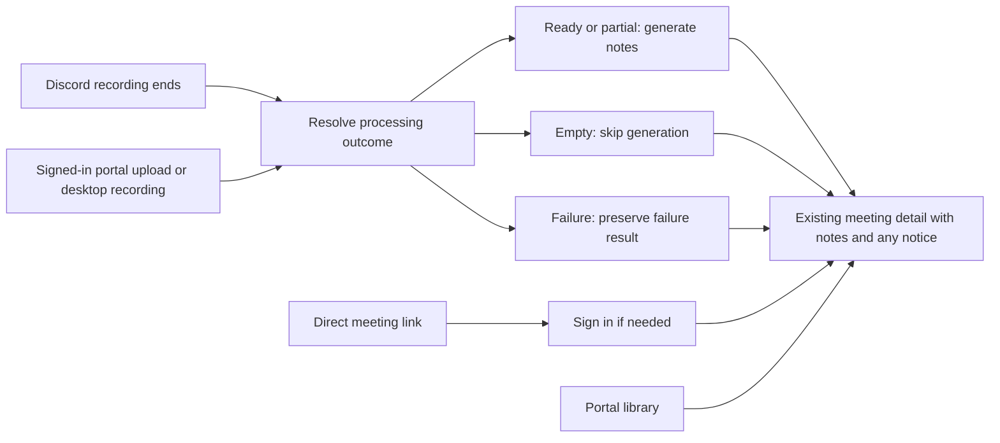

# Recording processing outcomes

Status: implemented and verified locally. This document records the approved behavior and implementation boundaries. No deployment is claimed.

## Goal

Explain why a completed recording has no notes, and warn when generated notes use an incomplete transcript. Expected empty input must not look like a processing failure. Actual failures must remain visible.

## Approved behavior

| Final transcription result              | Notes behavior                            | Message                                                             |
| --------------------------------------- | ----------------------------------------- | ------------------------------------------------------------------- |
| Ready                                   | Generate notes normally                   | No processing notice                                                |
| Empty                                   | Skip notes and summary                    | No usable speech was found, so no notes were generated.             |
| Partial                                 | Generate notes from the usable transcript | Some audio could not be transcribed. These notes may be incomplete. |
| Failed, with no usable transcript       | Preserve retries and report failure       | Audio could not be transcribed, so no notes were generated.         |
| No recorded outcome on a legacy meeting | Retain existing fallback                  | Existing Discord/portal fallback                                    |

The empty message and partial message above are exact approved copy. BASIC explicitly combined no captured audio and no usable speech into one empty case. There are no separate public empty reasons. The failure wording is the implementation default, separate from the two explicitly approved messages.

Do not infer physical silence from an empty capture. Do not auto-cancel an empty meeting or delete its audio. Do not add a new meeting lifecycle state or processing page.

## Outcome rules

- An optional `processing` object on the in-memory meeting and persisted history carries transcription, notes and summary outcomes. Absence means unclassified, not empty.
- Transcription is `ready`, `empty`, `partial` or `failed`. Notes and summary are `generated`, `skipped` or `failed` after their work resolves. No new framework or background job is needed.
- Classify unformatted selected segment text, excluding whitespace and the historical failure placeholder. Speaker labels, headers, chat cues and artifact-object presence cannot establish speech.
- Empty means transcription work completed without usable text and without an unrecovered failure or known capture gap. Captured bytes and suppression counts are internal diagnostics, not user-facing subcategories.
- An exhausted required transcription/conversion failure or known lost capture is failed if no usable text remains, otherwise partial.
- Retried provider work that succeeds is not an unrecovered failure. A stale fast revision must not overwrite a later successful slow result. Successful fast coverage that replaces the slow pass is valid.
- Optional final-pass or cleanup failure with a usable baseline remains an operational warning, not automatically incomplete transcription. Final-pass suppression to an empty string remains authoritative. A successful refinement does not erase unrelated missing segments or capture gaps.
- No transcription request, cancellation, and disabled notes follow their current flows; absence of work must not become an empty-input notice.
- Generate notes for partial results. Keep the incompleteness notice outside stored/generated notes, correction prompts, summary inputs and transcript content.
- A later notes-generation error is separate from the transcription outcome. It must not become an empty-input explanation or a successful generated stage.

## Retry and finalization behavior

Discord resolves transcription after pending required work and final-pass selection finish. It resolves notes and summary generation once, before delivery and persistence. History saving reuses those resolved results. Calling an ensure helper again must not repeat an empty warning or retry a terminal generation failure implicitly.

Personal uploads retain their existing job-attempt limit and processed-segment reuse. Before the final allowed job attempt, a transcription failure still requeues the job. On the final allowed attempt, process the remaining available transcription inputs, collect successful text and classify the aggregate. If text survives a provider transcription failure, generate partial notes. If none survives, keep the upload failed. Download, normalization, artifact-storage and history-write failures remain job failures; do not swallow them to manufacture partial success. The partial outcome describes recoverable content processing, not a permission to ignore infrastructure errors.

A desktop segment with failed transcription must not be marked processed merely to finish its parent job. Partial job completion may retain failed segments and honest processed counts. Failed transcript segments do not remove their successfully normalized audio from the audio artifact. Cached successful segments remain reusable.

On terminal failure, history must stop appearing actively processing and carry a failed processing outcome. Use existing lifecycle `complete` to indicate that processing has ended and retain upload job `failed`; there is no existing meeting lifecycle `failed` value. Do not overwrite a valid completed history record when a later metadata write fails.

## Presentation and compatibility

Discord displays the empty/failure explanation in the notes embed. Partial notes retain their text and carry the exact warning as separate embed metadata, preserving pagination limits and existing non-pinging embed delivery. Edit, correction and rename operations must not silently remove the partial notice.

The portal displays the notice separately from Markdown notes. Empty recordings must not expose that notice as editable/copyable/generated note content. Manual edit/import remains available under existing permissions. If notes are later added, hide the obsolete empty/generation-failed explanation; retain a partial-transcript warning because editing notes does not restore missing audio.

Existing access checks and transcript/audio visibility controls remain unchanged. Add outcome metadata only to the authenticated meeting-detail response needed by the portal. Existing share, MCP, Notion and Markdown content contracts are outside this focused presentation change; do not inject operational notices into their notes text. Their behavior is an explicit scope boundary, not an assertion that they show the new notice.

Legacy records have no inferred or backfilled outcome. Preserve their existing unavailable behavior. Persisted optional properties require no table or infrastructure migration. Do not store exception messages, participant identifiers or content in the new outcome fields.

## Journey

Current: recording finishes, then Discord or meeting detail shows generic unavailable notes when there is no transcript.

Proposed:

No acquisition or purchase flow changes. No longer-term receiver redesign is part of this work.

## Telemetry and acceptance

Emit one structured terminal processing result from each processing owner with stage outcomes and numeric counts. Attach the same non-content values to Langfuse metadata. Preserve provider-attempt errors while making final recovery visible. Delivery results remain separate from generation results. Do not add or widen PostHog events.

Acceptance covers empty captured input, empty successful provider responses, guard-suppressed text, whitespace, failure placeholders, recovered retries, unrecovered partial failures, fully failed processing, optional refinement failure, double ensure calls, personal retries and segment reuse, legacy records, manual note edits, and Discord/portal rendering. Portal changes require Storybook screenshot capture and VLM review plus relevant existing visual and scroll checks.

## Evidence and boundaries

The investigated warning occurred twice because normal finalization and history saving both called the helper on an empty meeting. The connection error was a separate recovered event. A dependency-free diagnostic reproduced zero model calls and two warnings for empty input. This supports explicit result handling, not a provider retry-policy change or receiver rewrite.

Source baseline: `888ec976f90c02db791c9bef471586f8a2991a28`. The local detailed investigation is `.cache/2026-09-16-transcription-diagnosis.md`; it is not needed to execute this design and must not be committed as customer-specific evidence. No production operations, push, PR, merge, deployment or customer contact are authorized by this planning artifact.
