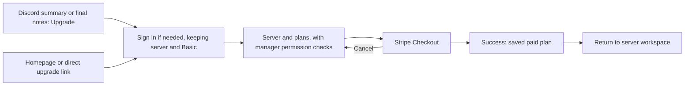

# Upgrade flow

## Current experience

- Entry points live on the marketing site at `/upgrade` and `/promo/:code`.
- The dedicated server picker and plan selection live at `/upgrade/select-server`.
- Stripe Checkout handles payment and returns to `/upgrade/success`.
- The success page highlights the upgraded server when a server id is available and routes users back into the portal.
- Eligible Free-server meeting summaries and the final notes embed include an Upgrade link with the server and Basic plan preselected. The copy shows recorded time across saved meetings, describes more recording time and deeper meeting search, and invites people to help keep Chronote running. Minutes display through 60 minutes; longer totals display hours only, rounded down to one decimal place through 10 hours and whole hours above 10.

## Operational notes

- Promo codes can be prefilled from the promo landing page and are applied at checkout.
- The upgrade flow is designed to fast-track intent, so it bypasses the portal billing page and goes straight from server selection to Stripe.
- Summary nudges use an atomic guild-scoped receipt in the existing InteractionReceipt table, with a seven-day expiry. The next claim can atomically replace an expired receipt, independent of TTL cleanup, including in local DynamoDB. An active cooldown skips the history scan. History must succeed before the receipt is claimed, so failed or timed-out history leaves the next meeting eligible. A failed delivery or a receipt write that succeeds after the deadline can consume that week's reminder. The entire optional lookup has a one-second budget; slow or failed billing/history/receipt lookups omit the CTA and let meeting delivery continue. History queries receive the abort signal; no further pages or lookup stages start after the deadline. Paid, complimentary and forced tiers, unsuccessful meetings and existing billing pointers are excluded.
- Recorded time includes retained, non-canceled recorded meetings, including archived meetings, plus the completed current meeting once. It is not a lifetime counter and does not include deleted history. History lookup failures omit the offer; no estimated customer costs are quoted.

## Planned enhancements

- Short upgrade links stored in DynamoDB. These would map a short token to promo codes, suggested plans, and optional server defaults without exposing those details in the URL.
